

  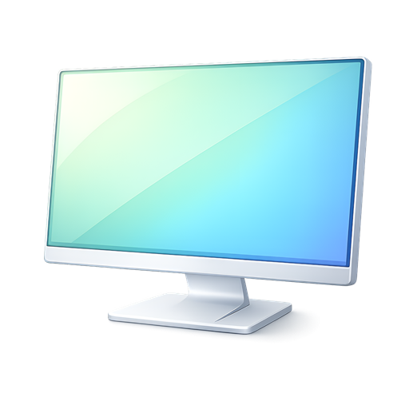

  <b>Build bootable Windows deployment media and run guided deployments from WinPE.</b>

  
  
  
  
  

  <a href="#download"><strong>Download</strong></a> ·
  <a href="https://foundry-osd.github.io/"><strong>Documentation</strong></a> ·
  <a href="#requirements"><strong>Requirements</strong></a> ·
  <a href="#workflow"><strong>Workflow</strong></a> ·
  <a href="#screenshots"><strong>Screenshots</strong></a> ·
  <a href="#ecosystem"><strong>Ecosystem</strong></a> ·
  <a href="#support"><strong>Support</strong></a>

---

## Overview

Foundry Project is a Windows deployment toolkit for building WinPE-based media and running repeatable deployment workflows. It separates media authoring, network readiness, and deployment execution into focused application surfaces.

| Surface | Runs where | Purpose |
| --- | --- | --- |
| Foundry OSD | Admin workstation | Check prerequisites, configure deployment behavior, and create ISO or USB media |
| Foundry Connect | WinPE target device | Validate or select network connectivity before deployment continues |
| Foundry Deploy | WinPE target device | Select deployment options and execute the Windows deployment |

This repository contains the Foundry OSD desktop application and the WinPE runtime agents used during deployment.

## Download

Install the latest MSI that matches the architecture of the admin workstation.

  
  &nbsp;&nbsp;&nbsp;
  

Use the MSI release build for normal deployment work. Use [all releases](https://github.com/foundry-osd/foundry/releases) when you need release notes, checksums, or older builds.

Start with the [Quick Start](https://foundry-osd.github.io/docs/start/quick-start) guide for the shortest end-to-end path.

## Requirements

Prepare an admin workstation with:

- Windows 10 or Windows 11
- Local administrator rights
- Internet access
- Windows ADK `10.1.26100.2454` or later
- Windows PE add-on for the same ADK release

Foundry OSD can help install or upgrade ADK components when they are missing or incompatible.

Current deployment scope:

- Windows 11 `23H2`, `24H2`, and `25H2`
- x64 and ARM64 deployment media
- WinPE driver injection for Dell and HP media driver packs
- Deployment-time operating system and driver choices loaded from the current catalog

## Workflow

Most deployments follow the standard path:

1. Install Foundry OSD on an admin workstation.
2. Create ISO or USB deployment media.
3. Boot the target device from the media.
4. Let the bootstrap open Foundry Connect and validate networking.
5. Let the bootstrap open Foundry Deploy.
6. Select the target disk, operating system, driver pack, and deployment options.
7. Review the summary and start deployment.

Use [Expert Mode](https://foundry-osd.github.io/docs/configure/expert-mode) only when the media must carry predefined network, localization, Autopilot, or machine naming behavior.

## Screenshots

<table>
  <tr>
    <td>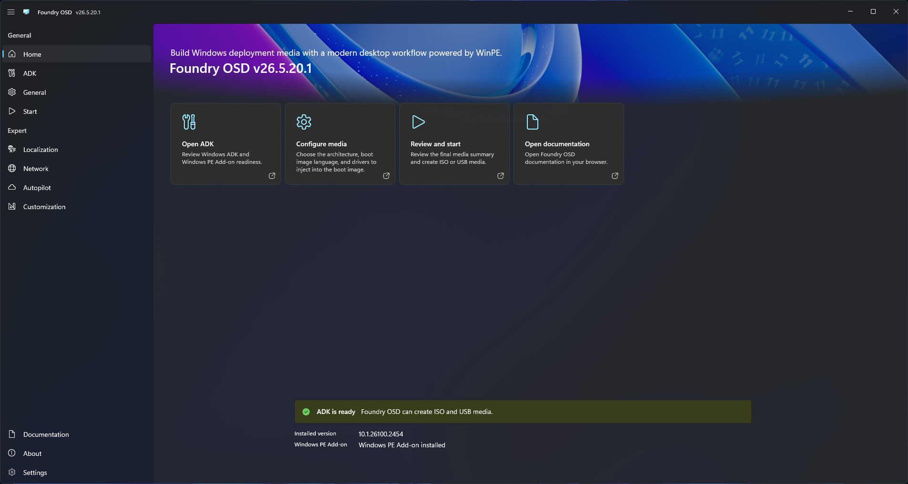</td>
    <td>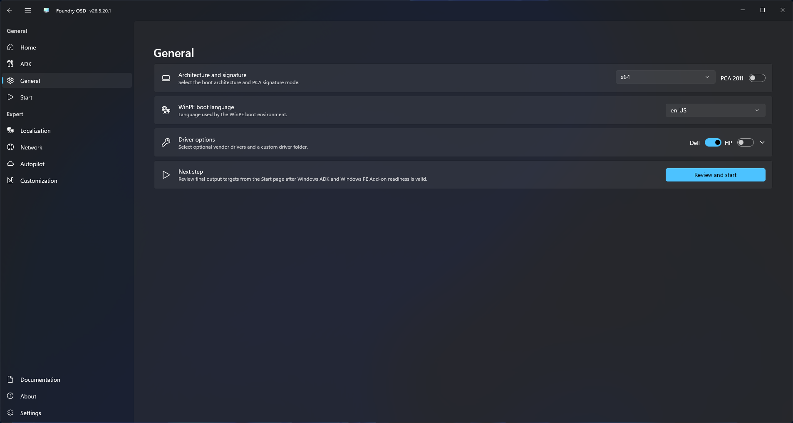</td>
  </tr>
  <tr>
    <td>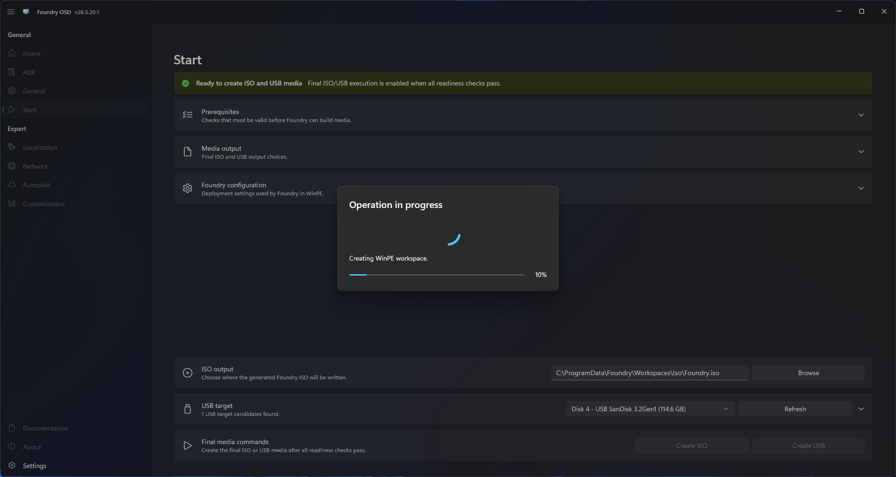</td>
    <td>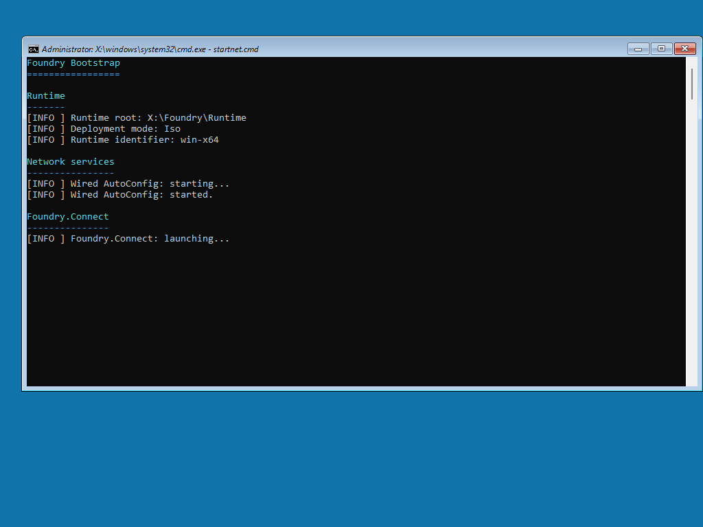</td>
  </tr>
  <tr>
    <td>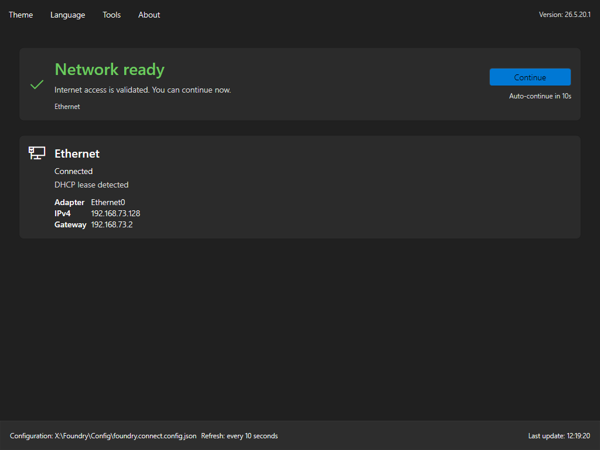</td>
    <td>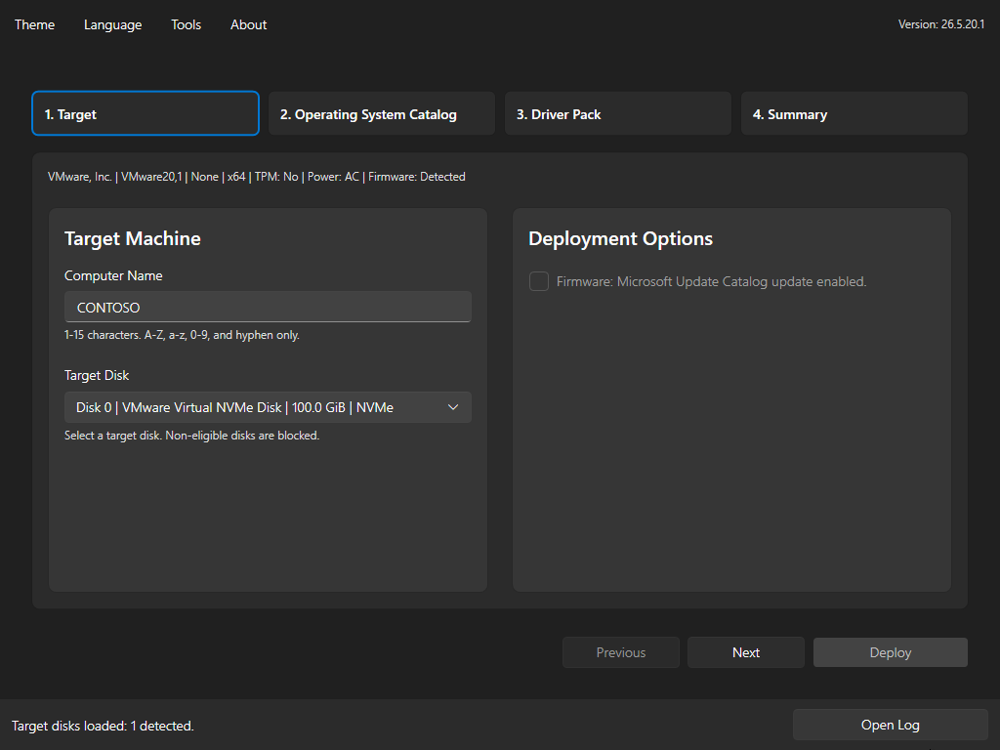</td>
  </tr>
  <tr>
    <td>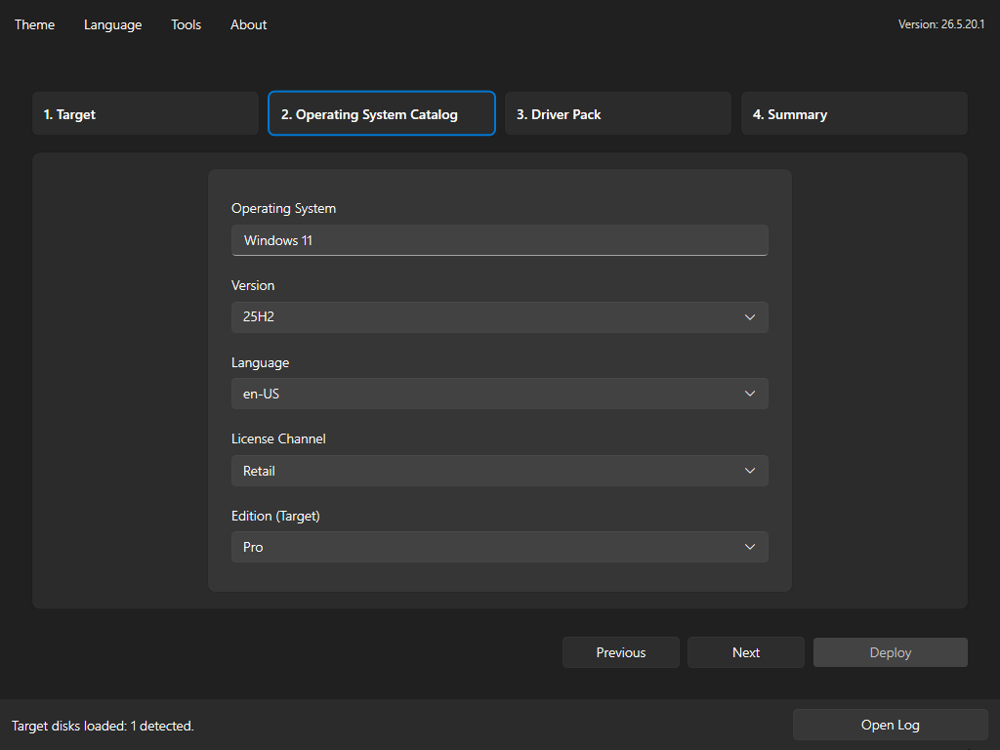</td>
    <td>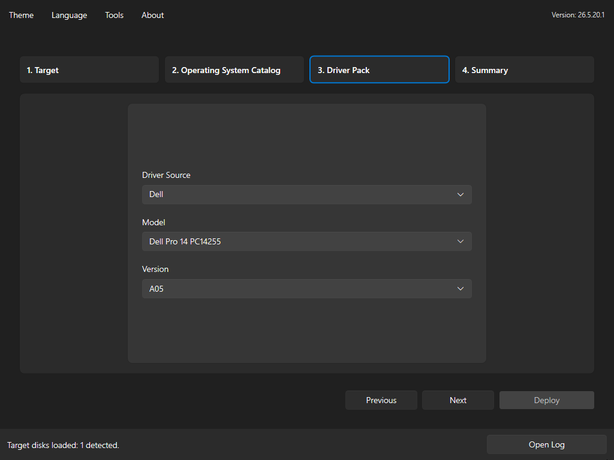</td>
  </tr>
  <tr>
    <td>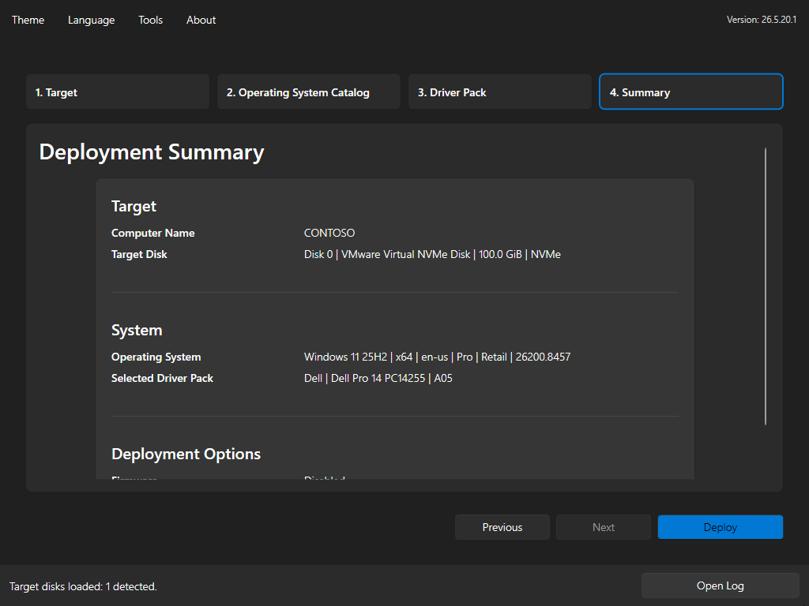</td>
    <td>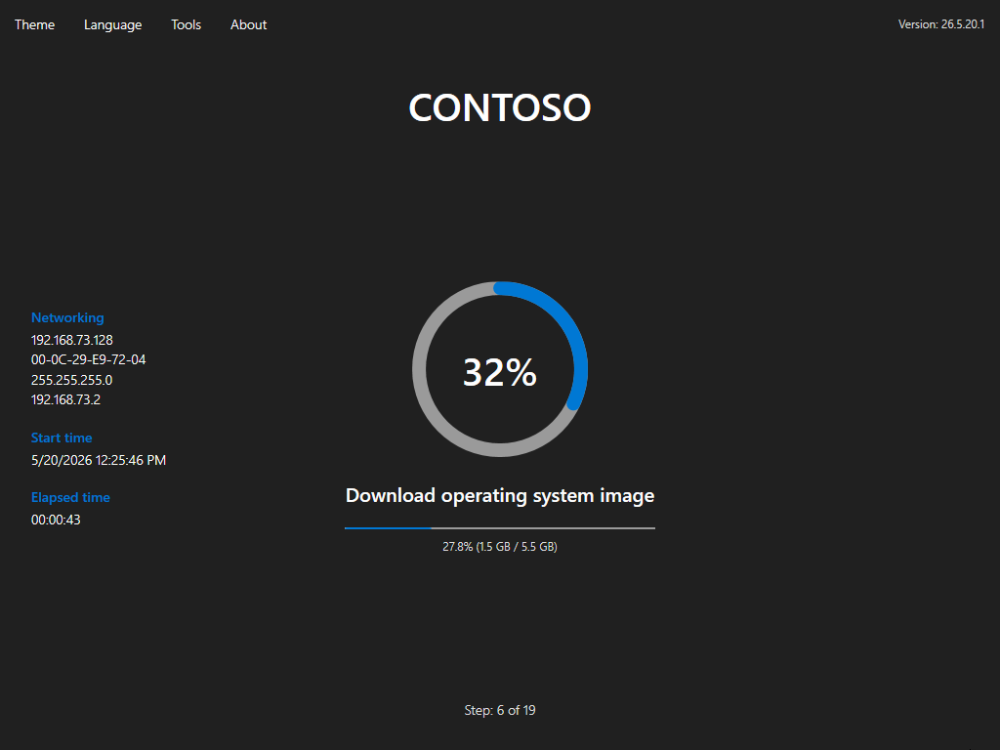</td>
  </tr>
  <tr>
    <td>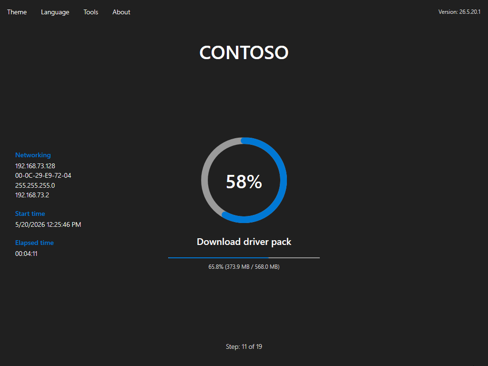</td>
    <td>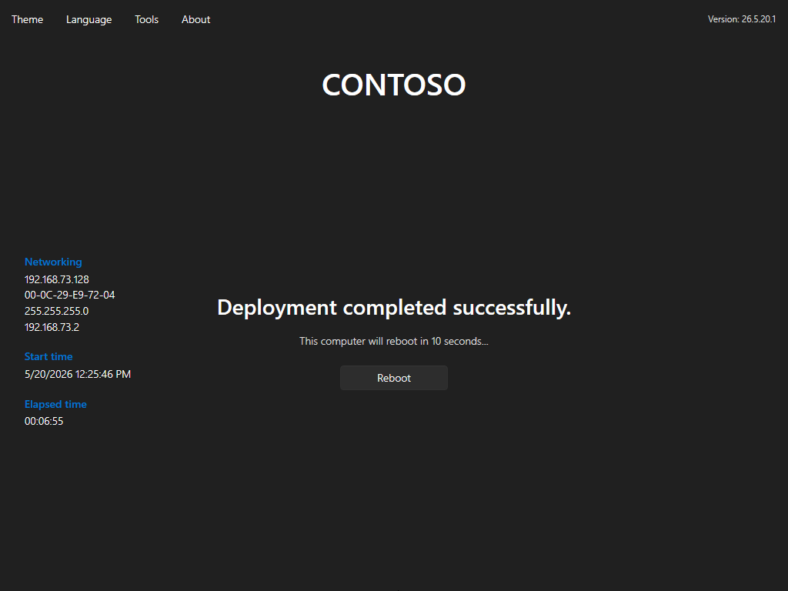</td>
  </tr>
  <tr>
    <td colspan="2">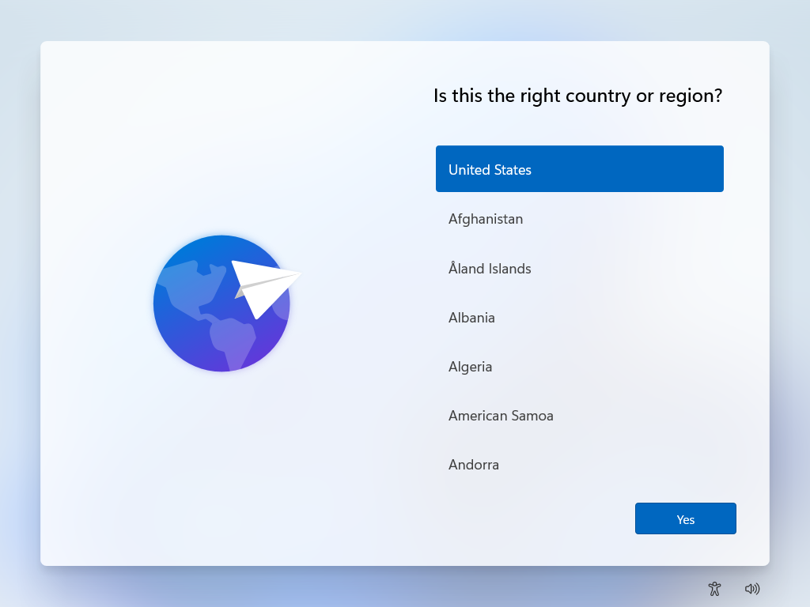</td>
  </tr>
</table>

## Ecosystem

Foundry Project is split across focused repositories:

- [`foundry`](https://github.com/foundry-osd/foundry): Foundry OSD, Foundry Connect, and Foundry Deploy.
- [`catalog`](https://github.com/foundry-osd/catalog): Catalog automation for operating system, driver pack, and WinPE metadata.
- [`foundry-osd.github.io`](https://foundry-osd.github.io/): Documentation, guides, and reference material.

## Telemetry

Foundry OSD collects anonymous usage telemetry to help prioritize project improvements. Telemetry is enabled by default and can be disabled from Settings. Generated Foundry Connect and Foundry Deploy runtime media follow the same setting.

See the [telemetry documentation](https://foundry-osd.github.io/docs/reference/telemetry) for collected events, excluded data, and privacy details.

## Support

Community involvement is welcome.

- **Bugs and feature requests:** Use the [issue tracker](https://github.com/foundry-osd/foundry/issues).
- **Local development:** Follow the [Developer Setup Guide](https://foundry-osd.github.io/docs/developer) for build requirements and local validation.

## Third-Party Notices

### 7-Zip Extra

This project uses parts of the 7-Zip program (`7za.exe`) from the 7-Zip Extra package.

- Upstream: [https://www.7-zip.org/](https://www.7-zip.org/)
- License: GNU LGPL with additional BSD 2-clause and BSD 3-clause notices for portions of `7za.exe`
- Included license files: `src/Foundry.Core/Assets/7z/License.txt`, `src/Foundry.Core/Assets/7z/readme.txt`
