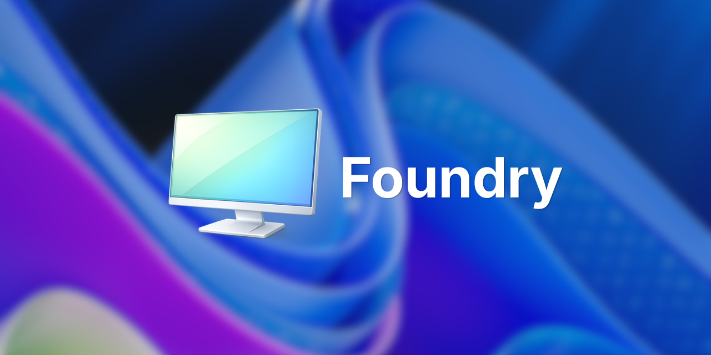

  

  <b>Modern Windows deployment for imaging, provisioning, and repeatable device setup.</b> 

  
  
  
  
  
  

  <a href="#-download--installation"><strong>📥 Download</strong></a> ·
  <a href="https://foundry-osd.github.io/"><strong>📖 Documentation</strong></a> ·
  <a href="#-the-foundry-ecosystem"><strong>🌍 Ecosystem</strong></a> ·
  <a href="https://github.com/foundry-osd/foundry/issues"><strong>🐛 Report an Issue</strong></a>

---

Foundry replaces legacy imaging scripts with Foundry OSD, a clean, fully-guided modern desktop UI. Whether you are deploying dozens of machines in an enterprise or just standardizing your personal setups, Foundry ensures you always have the right drivers, the right OS version, and a repeatable configuration.

  

## 📥 Download & Installation

Get started by downloading the latest Foundry OSD MSI installer for your workstation architecture.

  
  &nbsp;&nbsp;&nbsp;
  

> 💡 **Next steps:** For prerequisites (like the Windows ADK) and how to configure your first deployment, check out our [Quick Start guide](https://foundry-osd.github.io/docs/start/quick-start).

## ✨ Highlights

*   **Desktop UI First:** Build WinPE-based ISO and bootable USB deployment media straight from a clean Windows application.
*   **Native Windows 11 Support:** Fully supports Windows 11 `23H2`, `24H2`, and `25H2` across both `x64` and `ARM64`.
*   **Automated Driver Matching:** Say goodbye to driver hunting. Enjoy best-in-class automated driver handling for OEMs like Dell, HP, Lenovo, and Microsoft Surface.
*   **Guided Zero-Touch & Lite-Touch:** Interactive prompts for target disk selection, OS version, machine naming, localization, and Autopilot staging natively inside WinPE.

## 🔄 The Deployment Workflow

Foundry breaks down the deployment journey into 4 straightforward steps:

1.  **🏗️ Create Media:** Run the `Foundry OSD` desktop app on your admin PC to craft your deployment media.
2.  **🌐 Connect:** Boot the target device into WinPE. `Foundry Connect` immediately kicks in to validate and secure wired or Wi-Fi network access.
3.  **🎯 Deploy:** `Foundry Deploy` launches a guided UI to select the target disk, desired OS, and auto-fetches the matched hardware drivers.
4.  **✅ Finish:** The OS image is downloaded, applied, and configured. The device reboots into a ready-to-use Windows state.

## 🌍 The Foundry Ecosystem

Foundry is more than just a single executable. It is supported by a modular ecosystem across dedicated repositories ensuring stability and easy contribution:

*   [`foundry`](https://github.com/foundry-osd/foundry) *(This repository)*: The core repository containing the Foundry OSD Windows desktop authoring app and the WinPE runtime agents (`Connect` and `Deploy`).
*   [`catalog`](https://github.com/foundry-osd/catalog): The automated backend engine that dynamically curates driver packs and OS catalogs, ensuring you always inject the exact vendor drivers needed during deployment.
*   [`foundry-osd.github.io`](https://foundry-osd.github.io/): Our comprehensive documentation and developer hub.

## 🛠️ Contributing & Support

We welcome community involvement! 
- **Bugs & Features:** Please report any issues or suggest features on our [Issue Tracker](https://github.com/foundry-osd/foundry/issues).
- **Compile Local:** If you want to contribute code, see the [Developer Setup Guide](https://foundry-osd.github.io/docs/developer) for details on compiling with the `.NET 10 SDK` and `Windows ADK`.

## ⚖️ Third-Party Notices

### 7-Zip Extra
This project uses parts of the 7-Zip program (`7za.exe`) from the 7-Zip Extra package.
- Upstream: [https://www.7-zip.org/](https://www.7-zip.org/)
- License: GNU LGPL with additional BSD 2-clause and BSD 3-clause notices for portions of `7za.exe`
- Included license files: `src/Foundry/Assets/7z/License.txt`, `src/Foundry/Assets/7z/readme.txt`
